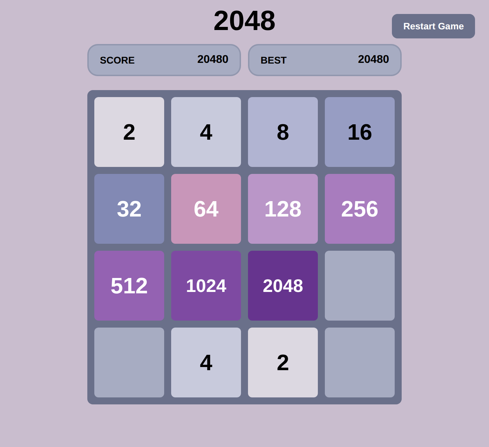

# 2048-js

A recreation of the sliding puzzle game **2048**, built from scratch with plain HTML, CSS and JavaScript. No frameworks, no libraries.

**[Play it here](https://fatmaalobeidli.github.io/2048-js/)**



## How to play

Use the **arrow keys** to slide all tiles in one direction. When two tiles with the same number touch, they merge into one tile with their sum. After every move, a new tile (2 or 4) appears on a random empty cell.

Reach the **2048** tile to win. You can keep playing afterwards. The game is over when the board is full and no merges are possible.

## Features

- Classic 4×4 board with correct 2048 merge rules (each tile merges only once per move)
- Score counter and best score, saved in the browser via `localStorage`
- Pop animations for newly spawned and merged tiles
- "Reduce motion" setting to turn animations off (defaults to the system setting, choice is saved)
- Restart button

## Run it locally

No build step or installation needed.

```bash
git clone https://github.com/fatmaalobeidli/2048-js.git
cd 2048-js
```

Then open `index.html` in any browser.

## How it works

The board is stored as a 4×4 array of numbers, where `0` means an empty cell. After each move, `updateBoard()` redraws the 16 HTML cells from this array.

**One function for all four directions.** All movement is handled by a single function, `slide()`, which only knows how to move one row to the **left**:

1. Remove the empty cells: `[2, 0, 2, 4]` → `[2, 2, 4]`
2. Merge equal neighbours from left to right, skipping the partner tile so no tile merges twice: `[2, 2, 4]` → `[4, 4]`
3. Fill up with zeros: `[4, 4]` → `[4, 4, 0, 0]`

The other directions reuse it:

| Direction | How |
|---|---|
| Left | slide each row |
| Right | reverse the row, slide, reverse back |
| Up | take each column as an array, slide |
| Down | take each column, reverse, slide, reverse back |

A new tile only spawns if the move actually changed the board.

**Animations.** `slide()` also reports where merges happened. Those cells and the newly spawned tile get a CSS class (`tile-merged` or `tile-new`) that triggers a short `@keyframes` animation.

## Project structure

```
index.html   page layout and the 16 board cells
style.css    board, tile colours and animations
game.js      game logic, input handling and rendering
```

## Possible changes

- Real sliding animations (tiles moving across the board)
- Swipe controls for mobile
- Undo button
- Selectable board sizes

## Credits

The original 2048 game was created by [Gabriele Cirulli](https://github.com/gabrielecirulli/2048). This is my own implementation, written for learning purposes.
